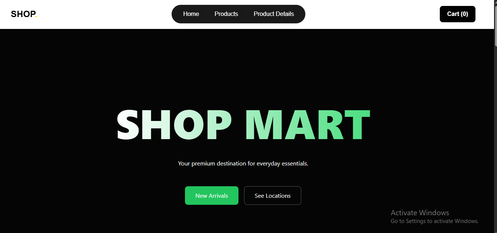
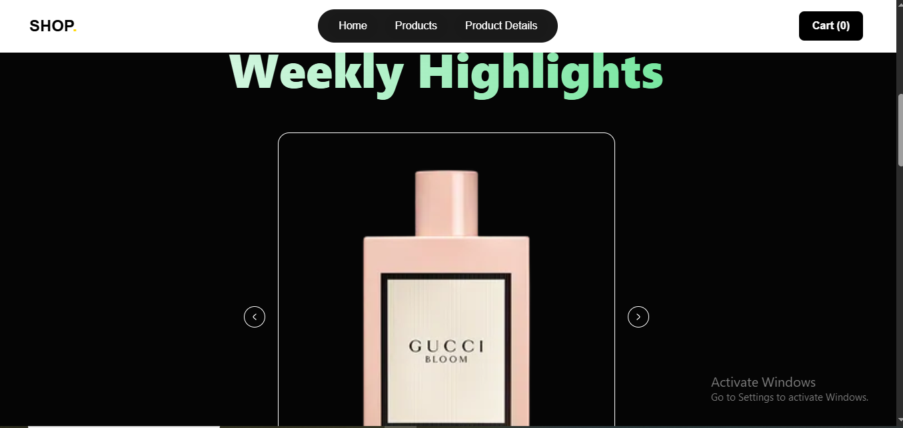
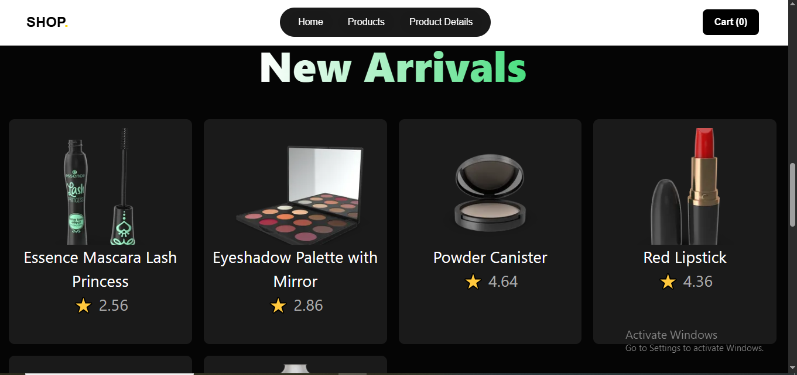
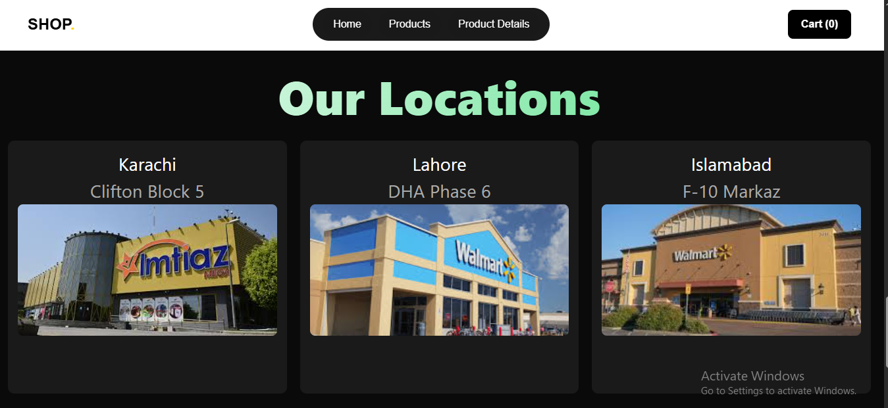
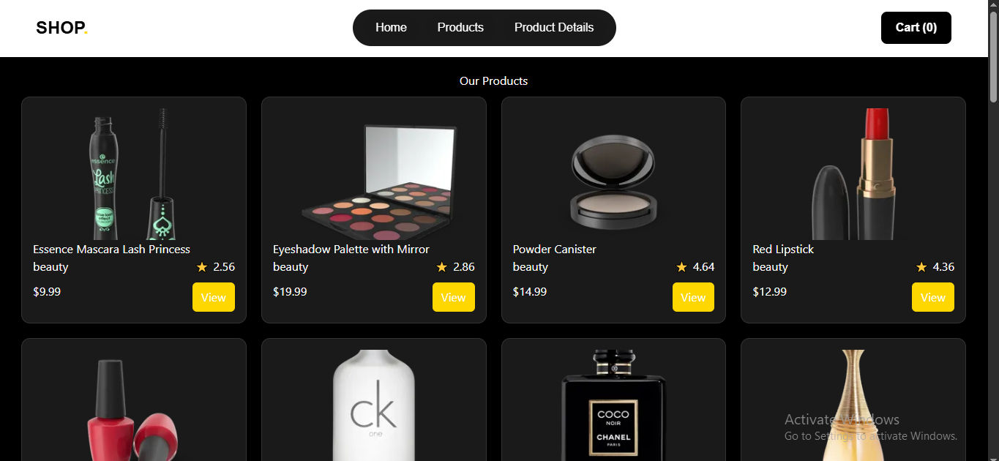
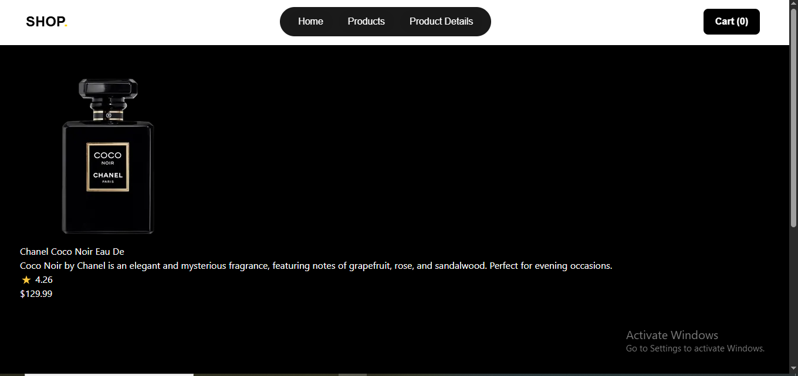

# 🛒 Shop Mart - React E-Commerce UI

A modern e-commerce frontend built with **React**, featuring dynamic routing, slug-based URLs, Context API state management, and a clean dark UI design.

---

## 🚀 Features

- 🛍️ Product listing with responsive grid layout  
- 📄 Dynamic product details page (React Router)  
- 🔗 SEO-friendly URLs using slugs  
- ⚡ Global state management using Context API  
- 🎨 Modern dark-themed UI  
- 🔄 Smooth navigation between pages  
- 🧩 Reusable components architecture  

---

## 🛠️ Tech Stack

- React JS  
- React Router DOM  
- Context API  
- JavaScript (ES6+)  
- Inline CSS Styling  
- slug
- useRef
- useState
- useEffect

---

## 📸 Screenshots

### 🏠 Home Page

#### s1

#### s2

#### s3

#### s4

---

### 🛍️ Products Page

---

### 📄 Product Details Page

